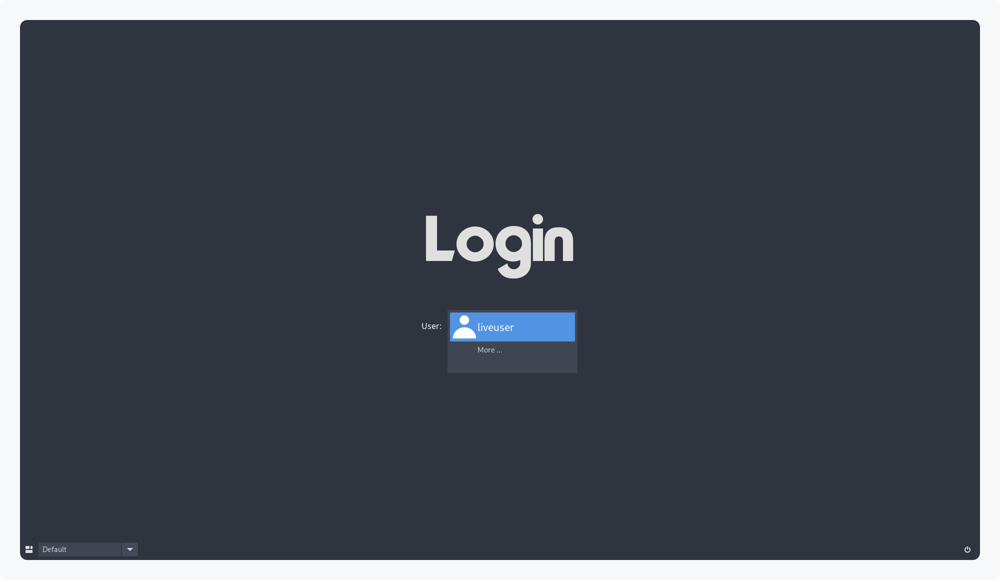
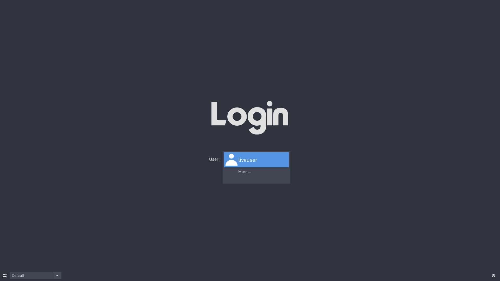
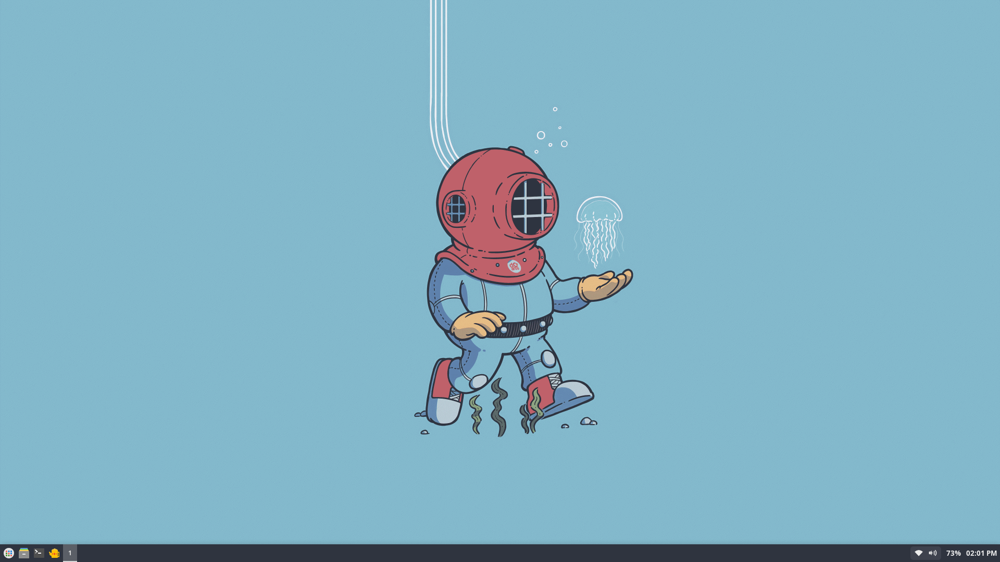
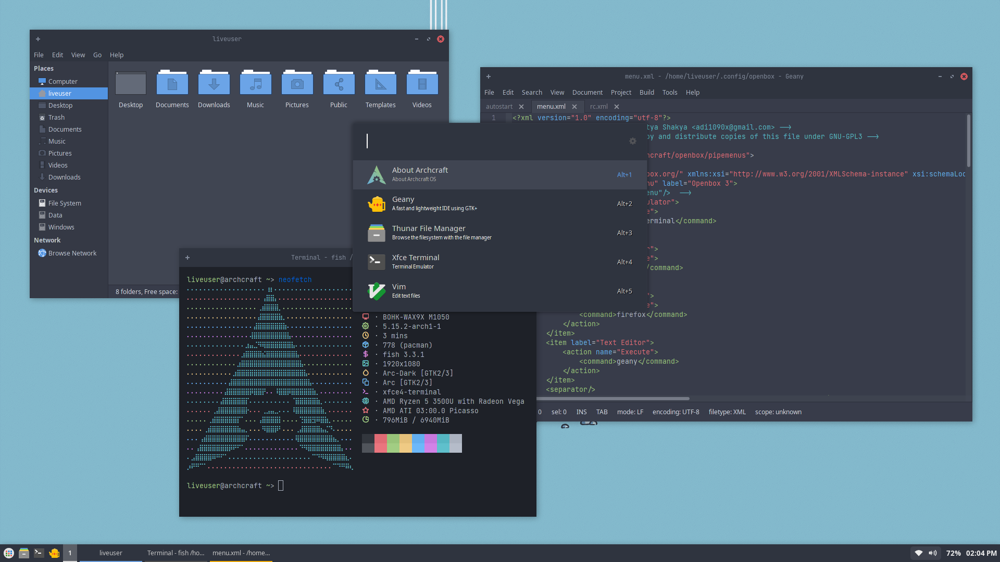
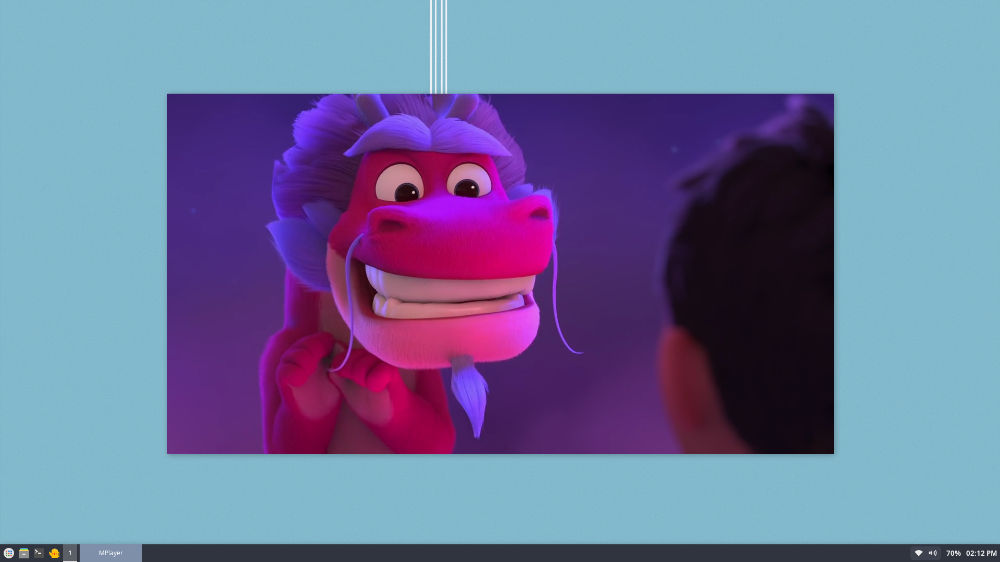
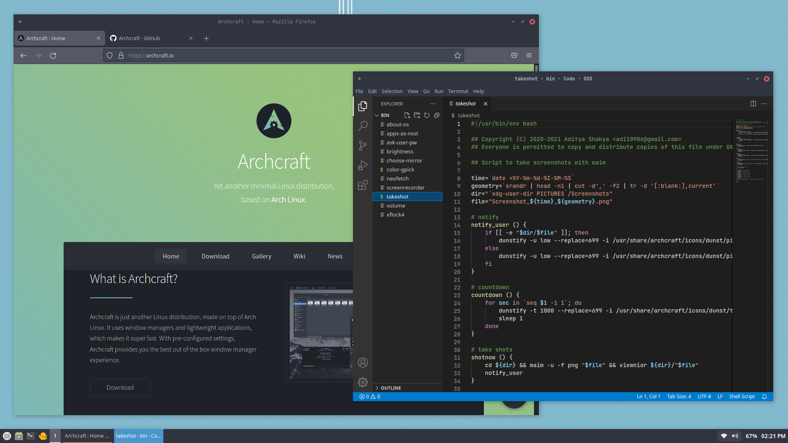
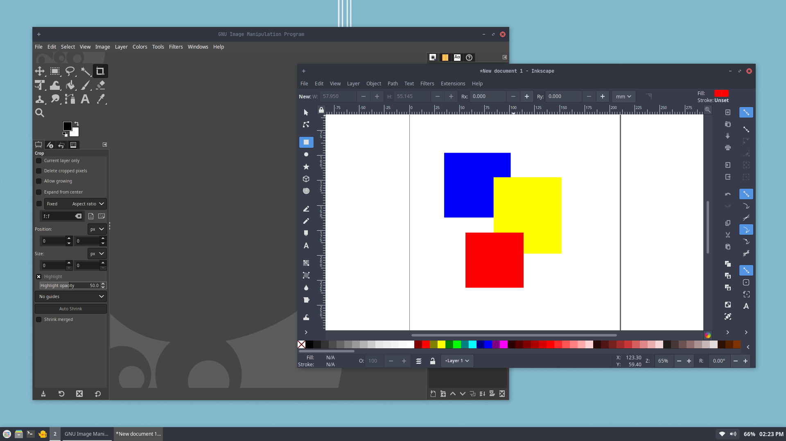

<p align="center">
<a href="https://archcraft.io"></a>
</p>

<p align="center">
<a href="https://www.buymeacoffee.com/adi1090x"></a>
<a href="https://ko-fi.com/adi1090x"></a>
<a href="https://www.paypal.com/cgi-bin/webscr?cmd=_s-xclick&hosted_button_id=6VETHHYHXESRN"></a>
</p>

<p align="center">
  
  
  
  
</p>

<p align="center">
A Nothing Version Of Archcraft, For Advanced Users.
</p>

<p align="center">
  <a href="https://archcraft.io" target="_blank"></a>
  <a href="https://wiki.archcraft.io" target="_blank"></a>
  <a href="https://archcraft.io/gallery" target="_blank"></a>
  <a href="https://www.reddit.com/r/archcraft" target="_blank"></a>
  <a href="https://discord.gg/3PzeJ5S7Pu" target="_blank"></a>
  <a href="https://t.me/archcraftos" target="_blank"></a>
  <a href="https://matrix.to/#/#archcraft:matrix.org" target="_blank"></a>
</p>



## Overview

**Compared to main [Archcraft](https://github.com/archcraft-os/archcraft), You'll not get -**
- Fancy Boot-loader (no grub themes)
- Fancy Boot Splash (no plymouth)
- Fancy Display Manager (themes and stuff)
- Multiple Window Managers and Styles
- Graphical / Calamares Installer
- Fancy Polybars, Rofi themes
- Even a Web Browser

**What you'll get -**
- A Simple Display Manager (`lxdm`)
- Just One Window Manager (`openbox`)
- A Smart and User-friendly shell (`fish`) 
- A Simple Panel (`tint2`)
- A Simple Launcher (`ulauncher`)
- Few Basic Apps (`terminal`, `file manager`, `text editor`)
- Few utilities (`media player`, `screen utilities`, `doc viewer`)
- Few CLI Programs (`vim`, `ranger`, `htop` etc)
- Just A CLI Installer (`abif`)
- And A Sweet Ocean-man...

## Latest Release

- **`ISO`** : [archcraft-lite-2021.11.13-x86_64.iso](https://github.com/archcraft-os/archcraft-lite/releases/download/v21.11/archcraft-lite-2021.11.13-x86_64.iso)
- **`SIG`** : [archcraft-lite-2021.11.13-x86_64.iso.sig](https://github.com/archcraft-os/archcraft-lite/releases/download/v21.11/archcraft-lite-2021.11.13-x86_64.iso.sig)
- **`SHA`** : [archcraft-lite-2021.11.13-x86_64.iso.sha256sum](https://github.com/archcraft-os/archcraft-lite/releases/download/v21.11/archcraft-lite-2021.11.13-x86_64.iso.sha256sum)
`3b9a9a13a5132ad7f8c5e2f369450f65cf7daf2b0979d847b400a598457571ec`
- **`TORRENT`** : [archcraft-lite-2021.11.13-x86_64.iso.torrent](https://github.com/archcraft-os/archcraft-lite/releases/download/v21.11/archcraft-lite-2021.11.13-x86_64.iso.torrent)

## Verify the authenticity of the ISO

- Download the **`ISO`**, **`gpg signature`** and **`sha256sum`** files
- Make sure all the files are present in the same directory (Assuming `~/Downloads`)
- First, Verify the details of the key on keyserver, Open a terminal and run (any one):
```
$ gpg --keyserver hkps://keys.gnupg.net --recv-keys 7DC81F73
$ gpg --keyserver hkps://keyserver.ubuntu.com --recv-keys 7DC81F73
$ gpg --keyserver hkp://pgp.mit.edu --recv-keys 7DC81F73
```

- Then, Open `terminal` in the `~/Downloads` folder and run following command :
```
$ gpg --verify archcraft-lite-2021.11.13-x86_64.iso.sig
```

- Finally, Verify the `sha256sum` by running :
```
$ sha256sum -c archcraft-lite-2021.11.13-x86_64.iso.sha256sum
```

## Screenshots

**`What you get :`**

|Display Manager|Window Manager|
|--|--|
|||

|Basic Applications|Media Player|
|--|--|
|||

**`Make it what you want :`**

|Firefox - Code|Gimp - Inkscape|
|--|--|
|||

---
> **`(!) This is a bloated distro. For People...`**
> - who think `X` is a bloat.
> - who think `WM` is a bloat.
> - who think `Terminal` is a bloat.
> - who think `File Manager, Text Editor` is a bloat.

> **`As mentioned above, This is only for ADVANCED and EXPERIENCED users.`**
> **`It's for people who want a distro with a bunch of basic programs, So using that as a base they can craft their Arch.`**

> Default `username` and `password` is **liveuser**.

> Don't forget to hit the **`STAR`** if you like it.
